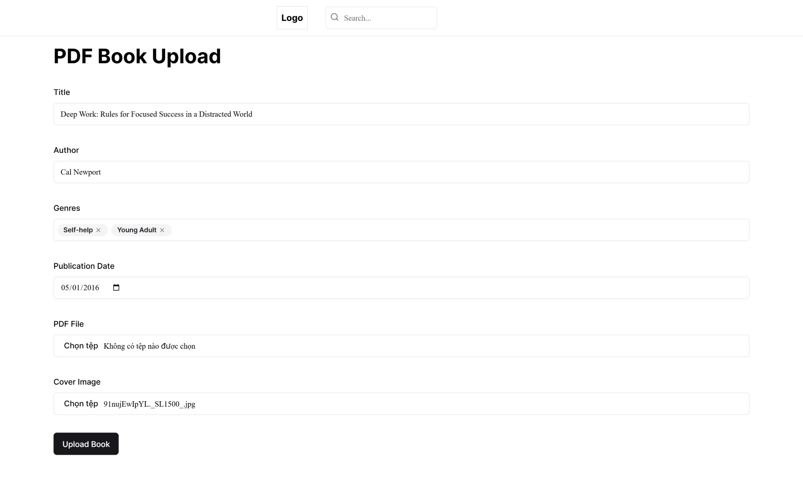

# Virtual Book Archive

## Members

| Name                | Student ID |
|---------------------|------------|
| Huỳnh Minh Khang    | SE192197   |
| Đặng Phương Nam     | SE192107   |
| Trương Lê Huy Hoàng | SE192052   |
| Nguyễn Anh Khoa     | SE192067   |

## Requirements

### System Name

**Virtual Book Archive**

### Purpose

The Virtual Book Archive provides a platform for users to read, share, and discuss e-books. It aims to create a community-driven digital library with easy access to a wide range of books.

### Target Users

- **Learners** – Students and self-learners looking for educational materials.
- **Book Enthusiasts** – Readers who enjoy exploring and discussing books.
- **Authors & Contributors** – Individuals who wish to share their own works.

### Functionality

#### Guest Users

- Search and filter books by title, author, genre, or keywords.  
- Read available books.
- Download books.
- View user profiles.
- Create a new user account.

#### Registered Users

Includes all guest functionalities plus:

- Log in and manage their account.
- Update profile.
- Upload books in supported formats.
- Rate books.
- Comment on books.
- Report inappropriate books or users.

#### Admin

- View and manage reported books and users.
- Remove users violating platform policies.  
- Remove books flagged as inappropriate or violating copyright.

## Wireframe or screenshots of the system

### GUIs
- Login page

- Create user page

- Home page

- Search page

- Summary page

- Read page

- User profile page

- User profile update page

- Upload book page

- Upload book page - genre choose

- Admin overview page

- Admin all book page

- Admin reported book page

- Admin all user page

- Admin reported user page

- Admin reported comment page

### Site Map

## Database design

## System design

### Technology

#### Spring Boot

- Spring Boot is a framework from the Spring team that makes it easy to create stand-alone, production-ready Spring-based applications with minimal configuration.
- It reduces boilerplate code by providing embedded servers, auto-configuration, and a set of “starter” dependencies.
- In addition, Spring Boot is especially well suited for building RESTful APIs, allowing you to quickly develop scalable web services with clear and concise endpoints.

#### Hibernate

- Hibernate is an object–relational mapping tool for Java.
- It maps Java classes to relational database tables and converts data between the two formats automatically.
- This allows developers to interact with a database by working with Java objects instead of writing SQL statements manually.

#### Java Persistence API (JPA)

- The Java Persistence API is a specification that standardizes the way Java objects are persisted and managed in a relational database.
- It provides a set of interfaces and annotations for mapping Java classes to database tables and for managing data in a vendor-independent manner.

#### JSON Web Token (JWT)

- JSON Web Token is an open standard that defines a compact and self-contained method for securely transmitting information between parties as a JSON object.
- It is widely used for stateless authentication, carrying user details (such as username and roles) in a digitally signed token that can be verified without storing session data on the server.

#### ReactJS

- ReactJS is a JavaScript library for building dynamic and interactive user interfaces.
- It uses a component-based architecture that encourages the creation of reusable UI components and efficient updates with its virtual DOM.
- This makes ReactJS an excellent choice for developing responsive front-end applications that consume your RESTful APIs.

#### Amazon S3

- Amazon S3 (Simple Storage Service) is an object storage service designed to deliver scalable, secure, and high-performance storage for any amount of data.
- It allows your application to store and retrieve files such as images, documents, and backups with ease.
- Integrating S3 offers cost-effective storage along with robust durability and availability, which is ideal for handling large amounts of user-generated content.

### Deployment Diagram

## Conclusion and Discussion

### Pros and Cons

- Pros
  - Images and PDF files are compressed and stored in Amazon S3.
  - API responses are compressed with gzip, improving network performance.
  - Stateless authentication using JWT simplifies scaling and reduces server load.
  - Clear separation between front-end and back-end through RESTful API design.
  - ORM with Hibernate and JPA makes database interactions simpler.
  - Docker and Docker Compose streamline development, testing, and deployment.
  - Paging in book search/listing improves performance.
  - The ReactJS front-end offers a responsive user interface.

- Cons
  - Error handling in the front-end is basic.
  - The current UI/UX could be further refined.
  - API logging is minimal, making troubleshooting more challenging.
  - Using ORM can introduce performance overhead in certain scenarios.
  - Images are not currently served via a CDN, potentially impacting load times.

### What we had learned

- Fundamentals of Spring and Spring Boot for building RESTful services.
- Hibernate and JPA.
- Implementing stateless authentication using JWT/JWS.
- Creating UIs with ReactJS.
- Amazon S3 for cloud file storage.
- Docker and Docker Compose for easier deployment.

### Future Improvement

- Better error handling on both front-end and back-end.
- Integrate Redis for caching to further boost performance.
- Implement more detailed API logging for easier debugging and monitoring.
- Migrate image storage to a CDN for faster content delivery.
- Improve UI/UX design and overall web design.
- Add more statistics to the admin UI.
